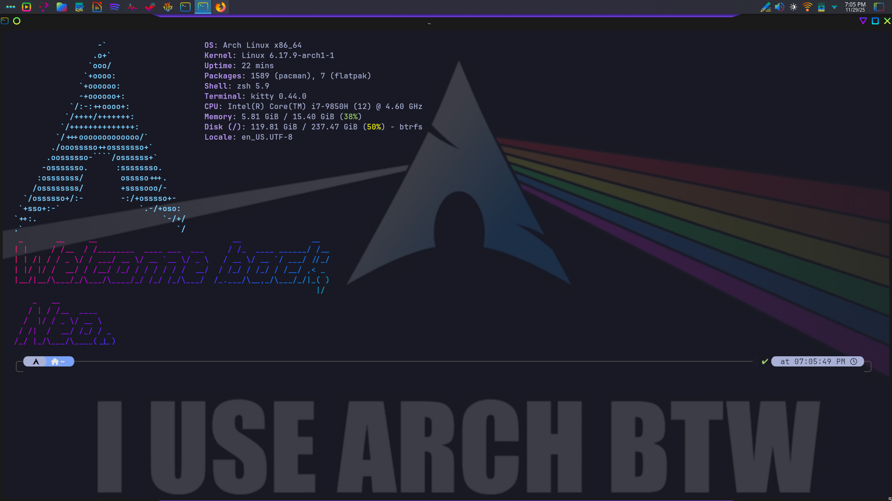
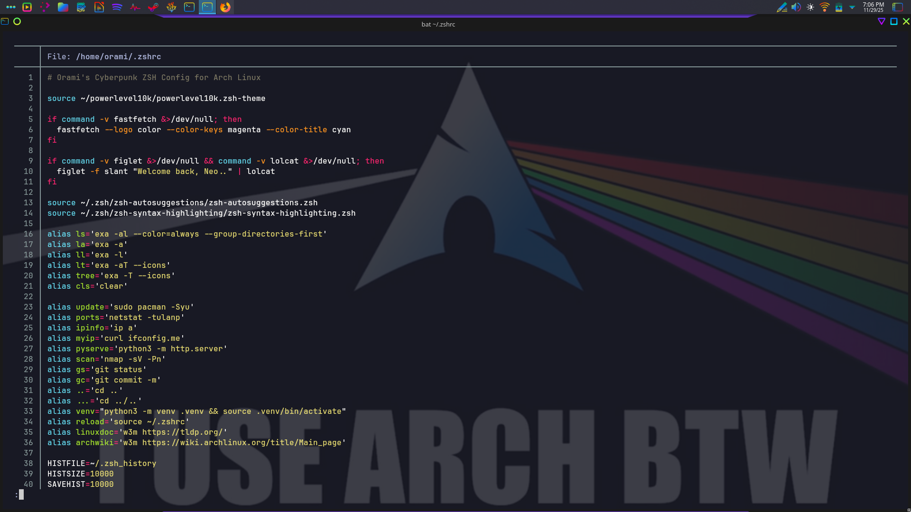
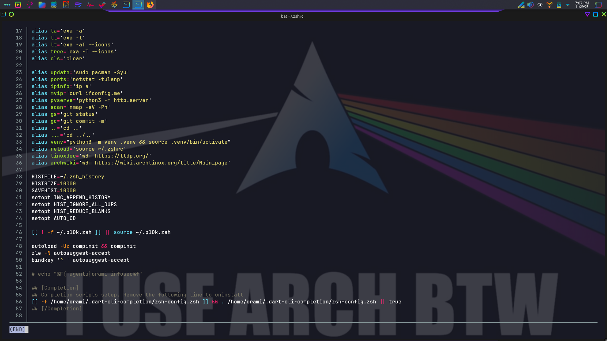
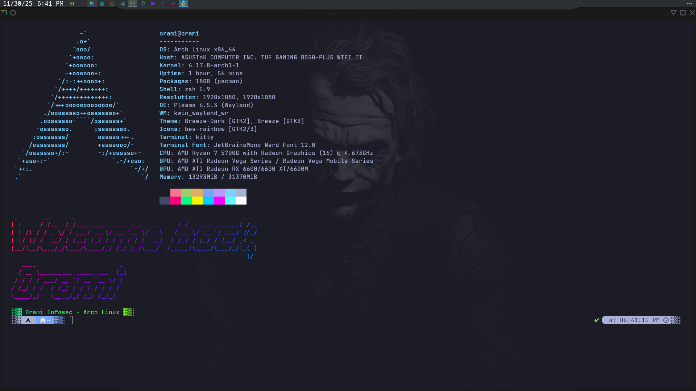

# zshrc.txt

A clean, customized `.zshrc` configuration for Zsh, compatible with
Powerlevel10k, Fastfetch, and Oh My Zsh. Includes useful aliases for
Arch Linux, Kali Linux, and other distros - without annoying warnings
on startup.

---

## Screenshots






---

## Requirements

Install these tools before applying the config. All are available via
your package manager.

| Tool | Purpose | Arch / Kali |
|---|---|---|
| `zsh` | Shell | `sudo pacman -S zsh` / `sudo apt install zsh` |
| `powerlevel10k` | Prompt theme | [github.com/romkatv/powerlevel10k](https://github.com/romkatv/powerlevel10k) |
| `fastfetch` | System info on startup | `sudo pacman -S fastfetch` / `sudo apt install fastfetch` |
| `figlet` | ASCII banner | `sudo pacman -S figlet` / `sudo apt install figlet` |
| `lolcat` | Rainbow color output | `sudo pacman -S lolcat` / `sudo apt install lolcat` |
| `eza` | Modern replacement for `ls` | `sudo pacman -S eza` / via cargo |
| `zsh-autosuggestions` | Command suggestions | [github.com/zsh-users/zsh-autosuggestions](https://github.com/zsh-users/zsh-autosuggestions) |
| `zsh-syntax-highlighting` | Command highlighting | [github.com/zsh-users/zsh-syntax-highlighting](https://github.com/zsh-users/zsh-syntax-highlighting) |

> `figlet` and `lolcat` are optional. If they are not installed,
> the banner is skipped. If `lolcat` is missing, the
> personal tag falls back to native Zsh magenta color.

---

## Installation

**1. Back up your current config:**
````bash
cp ~/.zshrc ~/.zshrc.bak
````

**2. Copy the new config:**
````bash
cp zshrc.txt ~/.zshrc
````

**3. Reload Zsh without closing the terminal:**
````bash
source ~/.zshrc
````

---

## What's included

**Startup**
- Guard that prevents fastfetch and banners from running in
  non-interactive sessions (SCP, rsync, scripts).
- Fastfetch / Neofetch system info display.
- Figlet + lolcat animated ASCII banner.
- Personal tag with lolcat gradient or Zsh magenta fallback.

**Shell behavior**
- Powerlevel10k theme.
- Zsh autosuggestions (accept with `Ctrl + Space`).
- Zsh syntax highlighting.
- Smart history: 10,000 entries, no duplicates, instant append.
- `AUTO_CD`, `CORRECT`, and `INTERACTIVE_COMMENTS` enabled.

**Environment**
- `EDITOR=nano`, `BROWSER=firefox`.
- `~/.local/bin` added to `PATH`.

**Aliases included**

| Category | Aliases |
|---|---|
| General | `cls`, `reload`, `..`, `...` |
| File listing | `ls`, `ll`, `la`, `lt`, `tree` (via eza/exa) |
| Pacman | `update`, `cleanup` |
| Network | `ports`, `ipinfo`, `myip` |
| Python | `venv`, `activate`, `pyserve` |
| Git | `gs`, `ga`, `gc`, `gp` |
| Pentest | `scan` (nmap), `sniff` (tcpdump) |
| XAMPP | `xampp-ui`, `xampp-start`, `xampp-stop`, `xampp-restart`, `xampp-status` |
| Laravel | `artisan`, `serve`, `migrate`, `fresh` |

---

## License

MITThis clean, custom .zshrc file is compatible with Oh My Zsh, Powerlevel10k, and Fastfetch and doesn't display annoying warnings. It also includes some useful aliases for Arch Linux, Kali Linux, or any other distro.
